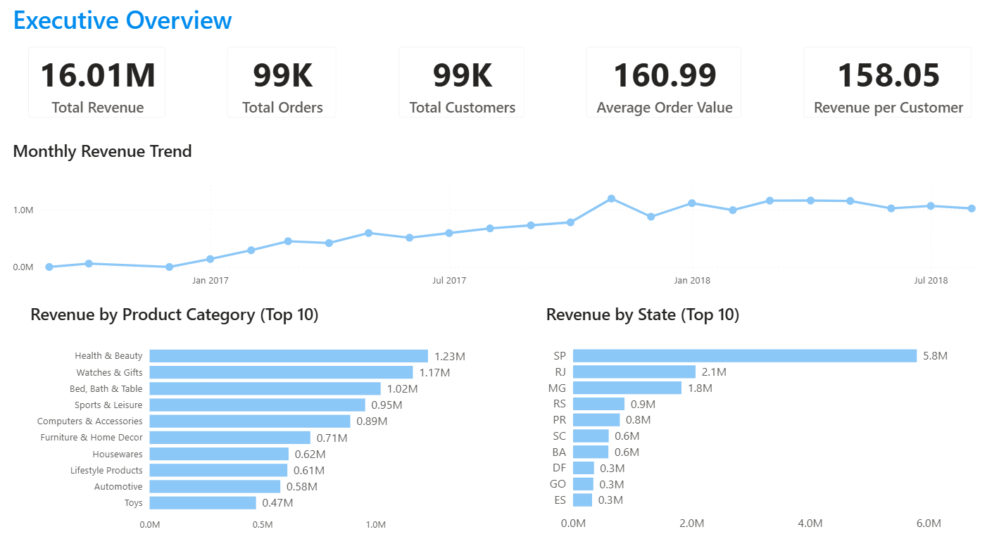
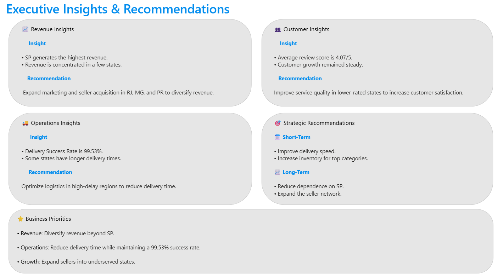
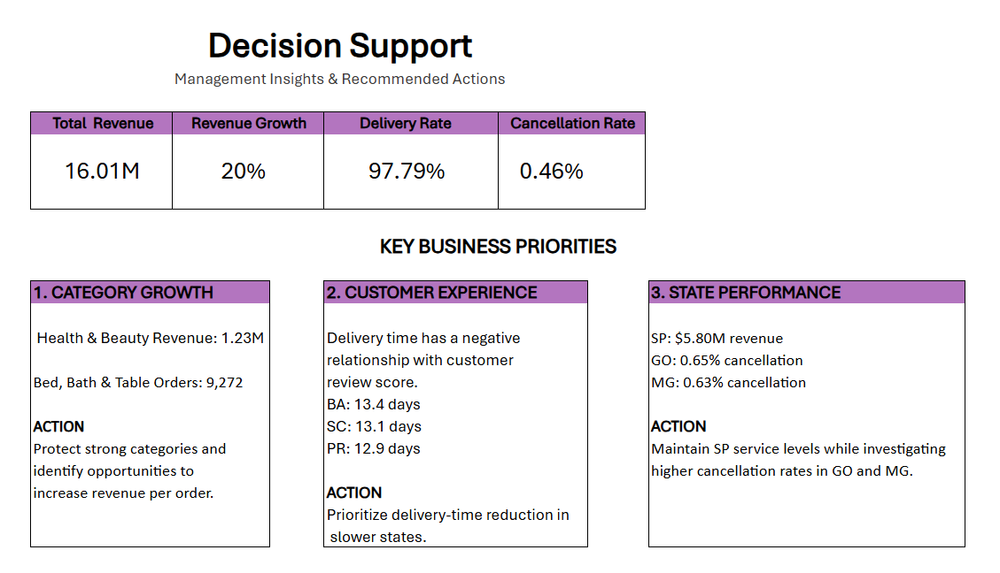
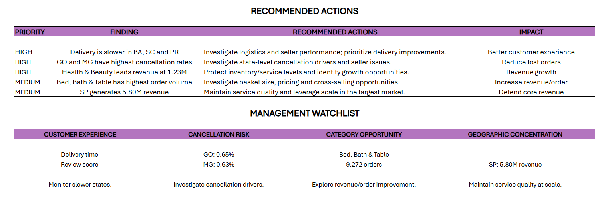
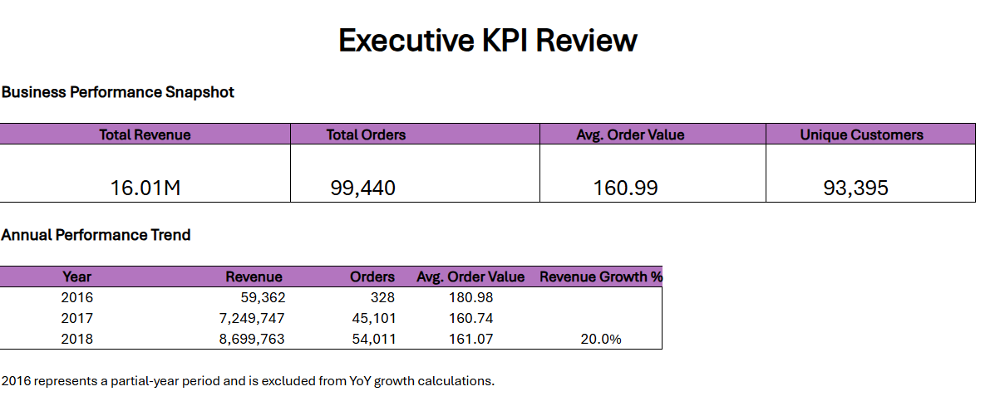
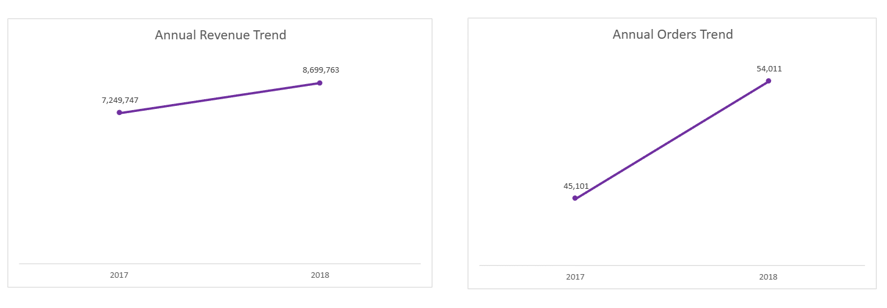

# 🛒 Olist E-Commerce Business Analytics

> **End-to-end business analytics project using PostgreSQL, SQL, Python, Power BI and Excel to transform raw e-commerce data into business insights, executive KPIs, decision support and actionable recommendations.**


---

## 🎯 Project Objective

The objective of this project was to analyze the Olist e-commerce business from a **business and decision-making perspective** and convert raw data into insights that can support management decisions.

The analysis focuses on questions such as:

- 💰 How is revenue performing and growing over time?
- 📦 How are order volumes and customer activity changing?
- 🛍️ Which product categories are driving revenue and order volume?
- 🌎 Which states generate the most revenue, and how concentrated is the business geographically?
- 🚚 Where are delivery-time and customer-experience issues?
- ⚠️ Where are cancellation risks higher?
- ⭐ What customer-experience factors deserve management attention?
- 🎯 What actions should management prioritize based on the analysis?

The project follows a complete analyst workflow:

**Raw Data → PostgreSQL → SQL → Python → Power BI → Excel → Business Insights → Recommended Actions**

### 🛠️ Tools Used

- 🗄️ **PostgreSQL** — database and data storage
- 🔎 **SQL** — querying, aggregation and business analysis
- 🐍 **Python** — supporting data preparation and analysis
- 📊 **Power BI** — interactive business intelligence and executive analysis
- 📑 **Microsoft Excel** — KPI reporting, trend analysis and management reporting

> **Power BI was completed first. Excel was subsequently created as a complementary reporting layer, translating the analysis into a structured executive KPI and management-reporting format.**

---

# 📊 Executive Overview

The Power BI analysis starts with a management-level view of the business, giving a quick understanding of overall performance before drilling into product, geographic and operational drivers.

### Key Business KPIs

| KPI | Result |
|---|---:|
| 💰 Total Revenue | **16.01M** |
| 📦 Total Orders | **99K** |
| 👥 Total Customers | **99K** |
| 🧾 Average Order Value | **160.99** |
| 💵 Revenue per Customer | **158.05** |

The business generated **16.01M in revenue** across approximately **99K orders**, while the monthly trend shows substantial scale-up across the main operating period.

The category and state breakdowns then reveal where that performance is coming from and where management should focus next.



*Executive overview combining core KPIs with monthly revenue trends, top product categories and top revenue-generating states.*

---

# 🔎 Business Insights

The project goes beyond reporting KPIs to identify the **drivers, risks and opportunities behind business performance**.

## 💰 Revenue & Growth

- **16.01M** total revenue across the analyzed period.
- Revenue increased strongly from 2017 to 2018, reaching approximately **20% YoY growth**.
- Revenue is concentrated geographically, with **São Paulo (SP)** contributing approximately **5.8M**.
- **Health & Beauty** is the leading product category by revenue at approximately **1.23M**.

## 🛍️ Product Category Performance

The category analysis highlights both revenue leaders and high-volume opportunities.

- **Health & Beauty:** approximately **1.23M** revenue
- **Watches & Gifts:** approximately **1.17M**
- **Bed, Bath & Table:** approximately **1.02M**
- **Bed, Bath & Table:** **9,272 orders**

This suggests two complementary opportunities:

1. Protect high-performing categories that already contribute significant revenue.
2. Investigate ways to increase **revenue per order** in high-volume categories through basket size, pricing and cross-selling.

## 🌎 Geographic Performance

- **SP:** approximately **5.80M revenue**
- **RJ:** approximately **2.1M**
- **MG:** approximately **1.8M**

The strong contribution from SP creates an important **geographic concentration consideration**: service quality must be maintained in the largest market while the business continues expanding into other states.

## 🚚 Customer Experience & Operations

Delivery performance differs significantly across states.

The analysis highlighted slower delivery times in:

- **BA:** 13.4 days
- **SC:** 13.1 days
- **PR:** 12.9 days

These differences create an opportunity to improve logistics performance and customer experience in slower regions.

The analysis also identified state-level cancellation differences, with **GO at 0.65%** and **MG at 0.63%**, making these locations worth investigating for potential cancellation drivers.



*Executive insights connecting revenue concentration, category performance, customer experience and operational findings to management-level observations.*

---

# 🎯 Turning Insights Into Decision Support

A major objective of the project was to avoid stopping at **“what happened?”**

The analysis was converted into three major business priorities:

### 1. 🛍️ Category Growth

**Finding:** Health & Beauty generates approximately **1.23M** in revenue, while Bed, Bath & Table has **9,272 orders**.

**Action:** Protect strong categories and identify opportunities to increase **revenue per order** through basket size, pricing and cross-selling.

### 2. 🚚 Customer Experience

**Finding:** BA, SC and PR show longer delivery times.

**Action:** Prioritize delivery-time reduction in slower states and investigate logistics and seller performance.

### 3. 🌎 State Performance

**Finding:** SP generates approximately **5.80M** revenue, while GO and MG show comparatively higher cancellation rates.

**Action:** Maintain service quality in the core SP market while investigating cancellation drivers in GO and MG.



*Decision-support view translating analysis into clear business priorities and management actions.*

---

# 🚀 Recommended Actions

The findings were then prioritized according to potential business impact.

| Priority | Finding | Recommended Action | Business Impact |
|---|---|---|---|
| 🔴 **HIGH** | Delivery is slower in BA, SC and PR | Investigate logistics and seller performance; prioritize delivery improvements | Better customer experience |
| 🔴 **HIGH** | GO and MG have comparatively higher cancellation rates | Investigate state-level cancellation drivers and seller issues | Reduce lost orders |
| 🔴 **HIGH** | Health & Beauty leads revenue at **1.23M** | Protect inventory/service levels and identify growth opportunities | Revenue growth |
| 🟡 **MEDIUM** | Bed, Bath & Table has **9,272 orders** | Investigate basket size, pricing and cross-selling opportunities | Increase revenue/order |
| 🟡 **MEDIUM** | SP generates approximately **5.80M** | Maintain service quality and leverage scale in the largest market | Defend core revenue |

### Management Watchlist

The analysis creates a practical watchlist around four areas:

- 🚚 **Customer Experience** — delivery time and review score
- ⚠️ **Cancellation Risk** — state-level cancellation patterns
- 🛍️ **Category Opportunity** — high-volume categories and revenue/order improvement
- 🌎 **Geographic Concentration** — dependence on the largest revenue-generating state



*Prioritized recommendations and management watchlist showing how the analysis can be converted into concrete business actions.*

---

# 📑 Excel Executive KPI Review

After completing the Power BI analysis, the project was extended into **Excel** to create a more traditional executive reporting layer.

The Excel analysis focuses on:

- 📌 Executive KPI reporting
- 📈 Annual performance trends
- 💰 Revenue analysis
- 📦 Order analysis
- 🧾 Average Order Value
- 📊 Revenue growth
- 🎯 Management reporting
- 🚀 Recommended business actions

### Executive KPI Snapshot

| KPI | Result |
|---|---:|
| 💰 Total Revenue | **16.01M** |
| 📦 Total Orders | **99,440** |
| 🧾 Average Order Value | **160.99** |
| 👥 Unique Customers | **93,395** |

The annual analysis shows substantial growth from 2017 to 2018, while **2016 is treated as a partial-year period and excluded from YoY growth calculations** to avoid a misleading comparison.



*Excel executive KPI review presenting the business in a concise management-reporting format.*

---

# 📈 Annual Performance Trends

The Excel reporting layer provides a focused view of revenue and order growth.

### Revenue

- **2017:** 7.25M
- **2018:** 8.70M
- **YoY Revenue Growth:** **20.0%**

### Orders

- **2017:** 45,101
- **2018:** 54,011

This provides management with a straightforward view of how business scale changed between the primary operating years.



*Annual revenue and order trends supporting performance review and growth analysis.*

---

# 💼 Business Value

This project demonstrates a complete analyst-oriented process:

**Raw Data → Query → Analyze → Visualize → Identify Drivers & Risks → Quantify Opportunities → Recommend Actions**

Rather than building dashboards purely for visualization, the project focuses on answering:

> **What is happening? → Why does it matter? → What should the business do next?**

### Key Capabilities Demonstrated

- 🔎 SQL-based business analysis
- 📊 Power BI dashboard development
- 📑 Excel KPI and management reporting
- 📈 Revenue and trend analysis
- 🧮 KPI development and interpretation
- 🛍️ Product/category performance analysis
- 🌎 Geographic performance analysis
- 📦 Order and customer analysis
- 🚚 Operational performance analysis
- ⚠️ Risk identification
- 🎯 Decision-support analysis
- 💡 Business recommendation development
- 📋 Executive-focused reporting

---

# 🧰 Technical Stack

| Area | Technology |
|---|---|
| 🗄️ Database | **PostgreSQL** |
| 🔎 Querying & Analysis | **SQL** |
| 🐍 Supporting Analysis | Python |
| 📊 Business Intelligence | **Power BI** |
| 📑 Spreadsheet Analysis | **Microsoft Excel** |
| 🎯 Business Analysis | KPI Analysis, Trend Analysis, Revenue Analysis, Operational Analysis |
| 📋 Reporting | Executive Dashboards, KPI Reporting, Decision Support |

### Core Analyst Skills Demonstrated

**SQL · Power BI · Excel · Data Analysis · Business Intelligence · KPI Analysis · Dashboard Development · Business Analysis · Trend Analysis**

> Python is used as a **supporting component** of the workflow. The primary analytical emphasis of this project is on **SQL, Power BI and Excel**.

---

# 📂 Project Structure


olist-ecommerce-business-analytics/
│
├── data/
│   └── Raw / source datasets
│
├── sql/
│   └── SQL analysis and business queries
│
├── python/
│   └── Supporting analysis / data preparation
│
├── powerbi/
│   └── Power BI dashboard
│
├── excel/
│   └── Excel executive analysis
│
├── 01_Decision_Support_Priorities.png
├── 02_PowerBI_Executive_Overview.png
├── 03_Decision_Support_Actions.png
├── 04_PowerBI_Executive_Insights.png
├── 05_Excel_Executive_KPI_Review.png
└── 06_Excel_KPI_Trends.png


# 🧠 Key Takeaway

This project demonstrates how an analyst can take a business dataset and progress from **data extraction to executive decision support**:

> **Query the data → measure performance → identify business drivers and risks → quantify opportunities → recommend actions.**

The project combines **SQL, Power BI and Excel** to demonstrate practical skills relevant to:

* 📊 **Data Analyst**
* 💼 **Business Analyst**
* 📈 **BI Analyst**
* 💰 **Revenue Analyst**
* 🎯 **Strategy & Operations Analyst**
* 🧠 **Decision-Support / Analytics roles**

The strongest focus is on the ability to **analyze business performance, communicate findings clearly and translate analysis into actionable recommendations**.

---

## 👤 About

**Harsh**  
B.Tech Graduate from **Delhi Technological University (DTU)** focused on Data Analytics, Business Intelligence, and Business Decision Support.

Interested in analyst opportunities across:

* 📊 Data Analytics
* 💼 Business Analytics
* 📈 Business Intelligence
* 💰 Revenue Analytics
* 🎯 Strategy & Operations Analytics
* 🧠 Decision-Support / Analyst Roles

### Core Skills

**SQL | Power BI | Excel | Data Analysis | Business Intelligence | KPI Reporting | Dashboard Development | Business Analysis**

---

# 🔗 Explore the Project

The complete project, including the analysis workflow and supporting files, is available here:

### 💻 GitHub

**[Olist E-Commerce Business Analytics](https://github.com/Harsh7768/olist-ecommerce-business-analytics)**

### 👤 LinkedIn

**[Harsh — LinkedIn](https://www.linkedin.com/in/harsh7768/)**

---

> ⭐ **Built with a business-first mindset: turning data into insights, insights into decisions, and decisions into measurable business opportunities.**

```
